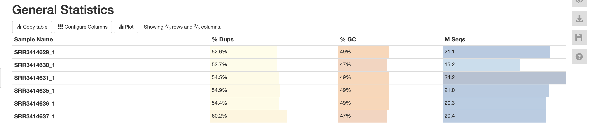

# ДЗ 3
## Бордюгов Максим

[часть 1]
(https://colab.research.google.com/drive/1RGGCe0_LbdygMAMLnsc0SsdengBq1CwF?usp=sharing)

[часть 2]
(https://colab.research.google.com/drive/1N9u7_E4Y9Hga-lc8DGz0sES5HD8cTIaF?usp=sharing)

|id|Тип образца|Общее кол-во исходных чтений|Кол-во и процент чтений|Кол-во и процент уникально откартированных чтений|Общее кол-во чтений|
|:-:|:-:|:-:|:-:|:-:|:-:|
| SRR3414629 | reprogr | 21106089 | 20510113 | 97,18% | 18375819 | 87.06% | 16049597 |
| SRR3414630 | reprogr | 15244711 | 14832680 | 97,30% | 13186153 | 86.50% | 11465340 |
| SRR3414631 | reprogr | 24244069 | 23547686 | 97,13% | 20928923 | 86.33% | 18408834 |
| SRR3414635 | control | 20956475 | 10395865 | 97,32% | 18428302 | 87.94% | 16275982 |
| SRR3414636 | control | 20307147 | 19757059 | 97,29% | 17825368 | 87.78% | 15757569 |
| SRR3414637 | control | 20385570 | 19847291 | 97,36% | 17844841 | 87.54% | 15736965 |

